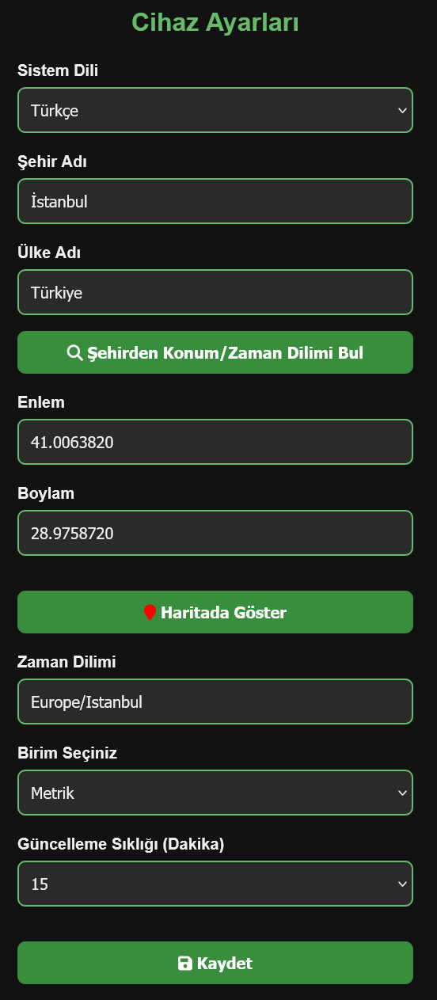
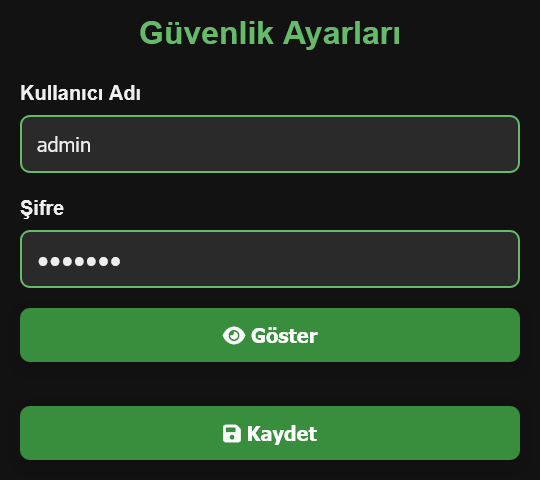

# ESP8266 Hava Durumu İstasyonu

[English Version](README_EN.md)

Bu proje, [ThingPulse - WeatherStationDemo](https://github.com/ThingPulse/esp8266-weather-station/tree/master/examples/WeatherStationDemo) örneği temel alınarak geliştirilmiştir. ESP8266 kullanılarak gerçek zamanlı veri sağlayan, mobil uyumlu ve kullanıcı dostu bir hava durumu istasyonu oluşturulmuştur.

## Özellikler

- Senkron Web Sunucusu ile kullanıcı dostu web arayüzü
- Ayarlar Sayfaları: Cihaz, Güvenlik, Dünya Saatleri, Döviz Kurları ve Varsayılanlara sıfırlama
- OTA Güncelleme: ElegantOTA ile uzaktan yazılım güncellemeleri
- WiFiManager: Gömülü Wi-Fi adı/şifresi gerekmeden yapılandırma
- Anlık Hava Durumu & Hava Kalitesi (AQI): OpenWeatherMap üzerinden
- UV İndeksi: Open-Meteo API'den gerçek zamanlı UV bilgisi
- Döviz Kurları: Floatrates API üzerinden
- Saat & Tarih Gösterimi: NTP sunucusu üzerinden
- Gece Modu (Donanımsal): Belirtilen saatlerde OLED ekran otomatik kapanır/açılır
- Tema Desteği: Web arayüzünde açık ve koyu tema seçeneği (Tema seçimi otomatik olarak sistemde kullanan tema aynı olacaktır.)
- Mobil Uyumlu Arayüz: Tüm cihazlarda uyumlu responsive tasarım
- Çoklu Dil Desteği: Şu anda **Türkçe** ve **İngilizce** arayüz seçeneği

## Web Arayüzü Ekran görüntüleri

Ana Sayfa

Cihaz Ayarları

Güvenlik Ayarları

Döviz Kuru Ayarları

## Kurulum aşamaları

- [OpenWeatherMap](https://openweathermap.org) ve [OpenCage](https://opencagedata.com) sitelerinden ücretsiz üyelik oluşturup API anahtarlarını alınız.

- Arduino IDE veya PlatformIO ile projeyi açın
- Eğer PlatformIO ile projeyi açacaksanız önce `platformio.ini` açıp terminal ekranında kütüphanelerin inmesi bekleyiniz. Gerekli bütün kütüphaneleri kendi otomatik olarak indirecektir.
- Eğer Arduino IDE ile projeyi açacaksanız önce ESP8266 kartını yükleyiniz. Daha sonra aşağıdaki kütüphaneleri yükleyiniz:
  - [ESP8266 and ESP32 OLED driver for SSD1306 displays](https://github.com/ThingPulse/esp8266-oled-ssd1306)  
  - [ElegantOTA](https://github.com/ayushsharma82/ElegantOTA)
  - [WiFiManager](https://github.com/tzapu/WiFiManager)
  - [Json Streaming Parser](https://github.com/squix78/json-streaming-parser)
  - [ArduinoJson](https://github.com/bblanchon/ArduinoJson)

- Daha sonra `esp8266_WeatherStation.ino` dosyasını açarak:
  - Eğer kullanmak istediğiniz dil Türkçe ise `#include "lang_tr.h"`, Eğer kullanmak istediğiniz dil İngilizce ise `#include "lang_en.h"` olarak değiştiriniz. Bu seçiminiz OLED ve web sayfası üzerinde bulunan yazılarının dili belirtmektedir.

- Yazılımı NodeMCU(ESP8266) cihaza yükleyin.

- Eğer WiFi ağınız daha önceden tanımlı ise kendisi otomatik olarak bağlanacaktır. WiFiManager ayarını yapmanıza gerek yoktur.

- Cihaz açıldığında WiFiManager aktifse OLED ekranda yazan WiFi ağına bağlanarak ayar portalını açınız.
  - **Configure WiFi** butona tıklayınız.
  - Yukarıdaki listeden WiFi ağını seçiniz.
  - Wifi ağı şifrenizi giriniz.
  - **Save** butonuna tıklayınız.
  - Sonra sistem kendiliğinden seçtiğiniz WiFi ağına bağlanacaktır.

- WiFi ağına bağlandıktan sonra cihazın IP adresi OLED ekranda yazacaktır. Tarayıcı üzerinden o IP adresine gidiniz. Eğer göremediyseniz merak etmeyin. Normal kullanım esnasında gözükecek sayfalar arasında IP adresini yazan sayfa bulunmaktadır. Oradan da IP adresini öğrenebilirsiniz.

- IP adrese gittikten sonra sizi web arayüzünün ana sayfası karşılacaktır.

- Ayar sayfalarına gitmek istediğinizde sizden kullanıcı adı ve şifre isteyecektir. Varsayılan kullanıcı adı: `admin` ve varsayılan şifre: `esp8266` olarak belirlenmiştir. Değiştirmek istediğiniz zaman **Güvenlik Ayarları** sayfasından değiştirebilirsiniz.

- Web arayüzü üzerinden önce **Cihaz Ayarları** sayfasına giderek:
  - OpenWeatherMap ve OpenCage API anahtarlarını giriniz.
  - İlçe, Şehir adlarını ve Ülke kodunu girip **Şehirden Konum/Zaman Bul** butonuna tıklayınız. Size otomatik olarak diğer gerekli ayarları yapacaktır.
  - Güncelleme sıklığı dakika olarak giriniz.
  - Gece modu zamanlaması için açılış ve kapanış zamanlarını giriniz.
  - **Kaydet** butona basınız. Bastıktan sonra sizi otomatik olarak ana sayfaya yönlendirecektir. Aynı zamanda OLED ekranda yeni değerler ile veriler güncellenecektir.

- Daha sonra web arayüzü üzerinden önce **Döviz Kurları Ayarları** sayfasına giderek:
  - 2 tane döviz kuru için temel para birimi ve hedef para birimi seçiniz.
  - **Kaydet** butona basınız. Bastıktan sonra sizi otomatik olarak ana sayfaya yönlendirecektir. Aynı zamanda OLED ekranda yeni değerler ile veriler güncellenecektir.

- OLED ekran üzerinden seçtiğiniz değerleri kontrol ettikten sonra gönül rahatlığıyla kullanmaya başlayabilirsiniz.

- Başka bir zaman seçtiğiniz ayarı değiştirmek için web arayüzünde ilgili sayfaya giderek gerekli değişiklikleri yapabilirsiniz.

## Donanım Gereksinimleri

- ESP8266 (NodeMCU, Wemos D1 Mini veya benzeri)  
- 0.96" I2C OLED ekran (SSD1306)
- Wi-Fi bağlantısı  
- 5V USB güç kaynağı

### OLED - NodeMCU (ESP8266) Bağlantı Tablosu

| OLED Pin Adı | NodeMCU (ESP8266) Pin |
|--------------|-----------------------|
| GND          | GND                   |
| VCC          | 3V3                   |
| SCL          | D1 (GPIO5)            |
| SDA          | D2 (GPIO4)            |

Bağlantı Şeması Kaynağı: [Random Nerd Tutorials](https://randomnerdtutorials.com/esp8266-0-96-inch-oled-display-with-arduino-ide/)

## Teşekkürler

- Demo Tabanı: [ThingPulse / WeatherStationDemo](https://github.com/ThingPulse/esp8266-weather-station/tree/master/examples/WeatherStationDemo)  
- OLED Ekran Kütüphanesi: [ESP8266 and ESP32 OLED driver for SSD1306 displays](https://github.com/ThingPulse/esp8266-oled-ssd1306)  
- OTA: [ElegantOTA](https://github.com/ayushsharma82/ElegantOTA)  
- Hava Verisi: [OpenWeatherMap](https://openweathermap.org)  
- UV Verisi: [Open-Meteo](https://open-meteo.com)  
- Saat: [NTP Sunucuları](https://pool.ntp.org)  
- WiFi Kurulumu: [WiFiManager](https://github.com/tzapu/WiFiManager)  
- Döviz Verisi: [Floatrates](https://www.floatrates.com)  
- Gece Modu Özelliği: [Qrome / PrinterMonitor](https://github.com/Qrome/printer-monitor)
- JSON: [Json Streaming Parser](https://github.com/squix78/json-streaming-parser) ve [ArduinoJson](https://github.com/bblanchon/ArduinoJson)
