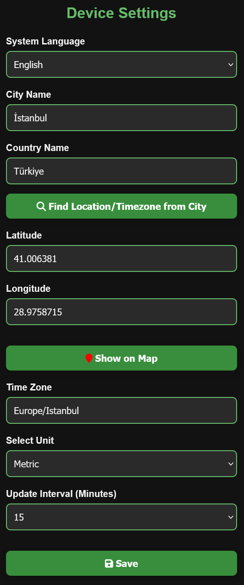
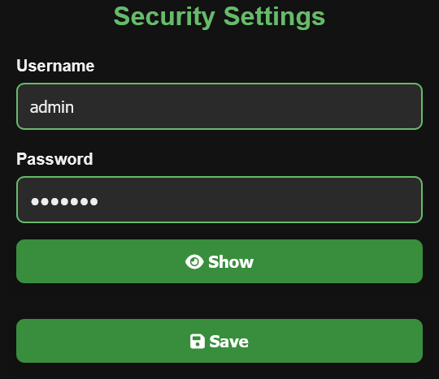

# ESP8266 Weather Station

This project is based on the [ThingPulse - WeatherStationDemo](https://github.com/ThingPulse/esp8266-weather-station/tree/master/examples/WeatherStationDemo) example and has been significantly extended to include real-time data, a mobile-friendly interface, and many advanced features.

## Features

- Synchronous Web Server with a user-friendly web interface
- Settings Pages: Device, Security, API Keys, Display, Currency Rates, and Restore to Default Settings
- OTA Updates: Remote firmware updates with ElegantOTA v3
- WiFiManager: No hardcoded Wi-Fi credentials required.
- Live Weather, Air Quality (AQI), Forecasts: From OpenWeatherMap API
- UV Index: Real-time UV data from Open-Meteo API
- Currency Rates: From Floatrates API
- Time & Date Display: Synced using NTP servers. Automatic daylight saving time compatibility is available.
- Night Mode: OLED display turns off/on automatically based on configured time.
- Display Rotation: Flip the OLED display vertically.
- Mobile-Friendly Interface: Fully responsive design
- Multi-language Support: Currently supports **Turkish** and **English**
- Indoor: Temperature and humidity data were obtained using a DHT22 sensor.

## Web Interface Screenshots

Home Page

API Key Settings

Device Settings

Display Settings

Security Settings

Currency Settings

Menu Example

## Hardware Requirements

- ESP8266 (NodeMCU, Wemos D1 Mini or similar)  
- 0.96" I2C OLED Display (SSD1306) 
- DHT22 
- Wi-Fi connection  
- 5V USB power supply

### NodeMCU (ESP8266) Wiring Table

| OLED Pin Name | NodeMCU (ESP8266) Pin |
| ------------- | --------------------- |
| GND           | GND                   |
| VCC           | 3V3                   |
| SCL           | D1 (GPIO5)            |
| SDA           | D2 (GPIO4)            |

| DHT22 Pin Name | NodeMCU (ESP8266) Pin |
| -------------- | --------------------- |
| GND            | GND                   |
| VCC            | 3V3                   |
| DATA           | D5 (GPIO14)           |

One lead of the 10K ohm resistor will be connected to the DATA pin, and the other lead will be connected to VCC.

Wiring Diagram Source: [Random Nerd Tutorials](https://randomnerdtutorials.com/esp32-esp8266-dht-temperature-and-humidity-oled-display/)

## Setup Instructions

- Create a free account on [OpenWeatherMap](https://openweathermap.org) and [OpenCage](https://opencagedata.com) and obtain API keys.

- Open the project using Arduino IDE or PlatformIO.
- If you are opening the project using PlatformIO, first open `platformio.ini` and wait for the libraries to download in the terminal window. It will automatically download all the necessary libraries.
- If you are opening the project using Arduino IDE, first install the ESP8266 board. Then install the following libraries:
  - [ESP8266 and ESP32 OLED driver for SSD1306 displays](https://github.com/ThingPulse/esp8266-oled-ssd1306)
  - [ElegantOTA](https://github.com/ayushsharma82/ElegantOTA)
  - [WiFiManager](https://github.com/tzapu/WiFiManager)
  - [Json Streaming Parser](https://github.com/squix78/json-streaming-parser)
  - [ArduinoJson](https://github.com/bblanchon/ArduinoJson)
  - [Adafruit Unified Sensor](https://github.com/adafruit/Adafruit_Sensor)
  - [DHT sensor library](https://github.com/adafruit/DHT-sensor-library)

- Then open the `esp8266_WeatherStation.ino` file:
  - If you want to use Turkish, change `#include "lang_tr.h"`, if you want to use English, change `#include "lang_en.h"`. This selection specifies the language of the text on the OLED and web page.

- Upload the software to the NodeMCU (ESP8266) device.

- If your WiFi network is already configured, it will connect automatically. You do not need to configure the WiFiManager settings.

- When the device is turned on, if WiFiManager is active, connect to the WiFi network displayed on the OLED display to open the settings portal.
  - Click the **Configure WiFi** button.
  - Select the WiFi network from the list above.
  - Enter your WiFi network password.
  - Click the **Save** button.
  - The system will then automatically connect to the WiFi network you selected.

- After connecting to the WiFi network, the device's IP address will be displayed on the OLED display. Go to that IP address via your browser. If you can't see it, don't worry. The page displaying the IP address is among the pages that will appear during normal use. You can also find the IP address there.

- After going to the IP address, you will be greeted by the main page of the web interface.

- When you want to go to the settings pages, you will be asked for a username and password. The default username is `admin` and the default password is `esp8266`. You can change them from the **Security Settings** page if you wish.

- First, go to the **API Key Settings** page via the web interface:
  - Enter the OpenWeatherMap and OpenCage API keys.
  - Click the **Save** button. After clicking, you will be automatically redirected to the home page.

- Then, go to the **Device Settings** page via the web interface:
  - Enter the city, country names then click the **Find Location/Time from City** button. It will automatically configure the other necessary settings for you.
  - If you know the latitude and longitude values, you can replace them with your own values. (You can find the latitude and longitude values on Google Maps.)
  - To check the latitude and longitude values entered, click the **Show on Map** button. (The location corresponding to the values entered will be displayed on Google Maps in the new tab.)
  - Select the update interval in minutes.
  - Click the **Save** button. After clicking, you will be automatically redirected to the main page. At the same time, the data will be updated with new values on the OLED display.

- Then, go to the **Display Settings** page via the web interface:
  - Select the display orientation, time format, and month display format in that order.
  - Enter the turn on and turn off times for night mode scheduling.  
  - Click the **Save** button. After clicking, you will be automatically redirected to the home page. At the same time, the data will be updated with the new values on the OLED display.

- Then, go to the **Currency Rate Settings** page via the web interface:
  - Select the base currency and target currency for 2 currency rates.
  - Click the **Save** button. After clicking, you will be automatically redirected to the main page. At the same time, the data will be updated with the new values on the OLED display.

- After checking the values you have selected on the OLED display, you can start using it with peace of mind.

- To change the settings you have selected at a later time, you can go to the relevant page on the web interface and make the necessary changes.

## Credits

- Demo Base: [ThingPulse / WeatherStationDemo](https://github.com/ThingPulse/esp8266-weather-station/tree/master/examples/WeatherStationDemo)  
- OLED Display Library: [ESP8266 and ESP32 OLED driver for SSD1306 displays](https://github.com/ThingPulse/esp8266-oled-ssd1306)  
- OTA Library: [ElegantOTA](https://github.com/ayushsharma82/ElegantOTA)  
- Weather Data: [OpenWeatherMap](https://openweathermap.org)  
- UV Index: [Open-Meteo](https://open-meteo.com)  
- Time Sync: [NTP Servers](https://pool.ntp.org)  
- WiFi Config Portal: [WiFiManager](https://github.com/tzapu/WiFiManager)  
- Currency Data: [Floatrates](https://www.floatrates.com)  
- Night Mode and Display Rotation Feature: [Qrome / PrinterMonitor](https://github.com/Qrome/printer-monitor)
- JSON Libraries: [Json Streaming Parser](https://github.com/squix78/json-streaming-parser) and [ArduinoJson](https://github.com/bblanchon/ArduinoJson)
- Timezones: [posix_tz_db](https://github.com/nayarsystems/posix_tz_db)
- DHT22 Libraries: [Adafruit Unified Sensor](https://github.com/adafruit/Adafruit_Sensor) and [DHT sensor library](https://github.com/adafruit/DHT-sensor-library)

# ESP8266 Hava Durumu İstasyonu

Bu proje, [ThingPulse - WeatherStationDemo](https://github.com/ThingPulse/esp8266-weather-station/tree/master/examples/WeatherStationDemo) örneği temel alınarak geliştirilmiştir. ESP8266 kullanılarak gerçek zamanlı veri sağlayan, mobil uyumlu ve kullanıcı dostu bir hava durumu istasyonu oluşturulmuştur.

## Özellikler

- Senkron Web Sunucusu ile kullanıcı dostu web arayüzü
- Ayarlar Sayfaları: Cihaz, Güvenlik, API Anahtarları, Ekran, Döviz Kurları ve Varsayılan ayarlara sıfırlama
- OTA Güncelleme: ElegantOTA ile uzaktan yazılım güncellemeleri
- WiFiManager: Gömülü Wi-Fi adı/şifresi gerekmeden yapılandırma
- Anlık Hava Durumu, Hava Kalitesi (AQI), Hava Tahminleri: OpenWeatherMap üzerinden alınmaktadır.
- UV İndeksi: Open-Meteo API'den gerçek zamanlı UV bilgisi
- Döviz Kurları: Floatrates API üzerinden alınmaktadır.
- Saat & Tarih Gösterimi: NTP sunucusu üzerinden alınmaktadır. Otomatik yaz saati uyumluluğu bulunmaktadır.
- Gece Modu : Belirtilen saatlerde OLED ekran otomatik açılır/kapanır.
- Ekran Döndürme: OLED ekranı dikey olarak döndürme
- Mobil Uyumlu Arayüz: Tüm cihazlarda uyumlu tasarım
- Çoklu Dil Desteği: Şu anda **Türkçe** ve **İngilizce** arayüz seçeneği
- İç Mekan: DHT22 sensörü ile sıcaklık ve nem bilgileri elde edildi.

## Web Arayüzü Ekran görüntüleri

Ana Sayfa

API Anahtar Ayarları

Cihaz Ayarları

Ekran Ayarları

Güvenlik Ayarları

Döviz Kuru Ayarları

Menü Örneği

## Donanım Gereksinimleri

- ESP8266 (NodeMCU, Wemos D1 Mini veya benzeri)  
- 0.96" I2C OLED ekran (SSD1306)
- DHT22
- Wi-Fi bağlantısı  
- 5V USB güç kaynağı

### NodeMCU (ESP8266) Bağlantı Tablosu

| OLED Pin Adı | NodeMCU (ESP8266) Pin |
| ------------ | --------------------- |
| GND          | GND                   |
| VCC          | 3V3                   |
| SCL          | D1 (GPIO5)            |
| SDA          | D2 (GPIO4)            |

| DHT22 Pin Adı | NodeMCU (ESP8266) Pin |
| ------------- | --------------------- |
| GND           | GND                   |
| VCC           | 3V3                   |
| DATA          | D5 (GPIO14)           |

10K ohm direncin bir ucu DATA pinine, diğer ucu ise VCC'ye bağlanacaktır.

Bağlantı Şeması Kaynağı: [Random Nerd Tutorials](https://randomnerdtutorials.com/esp32-esp8266-dht-temperature-and-humidity-oled-display/)

## Kurulum aşamaları

- [OpenWeatherMap](https://openweathermap.org) ve [OpenCage](https://opencagedata.com) sitelerinden ücretsiz üyelik oluşturup API anahtarlarını alınız.

- Arduino IDE veya PlatformIO ile projeyi açın
- Eğer PlatformIO ile projeyi açacaksanız önce `platformio.ini` açıp terminal ekranında kütüphanelerin inmesi bekleyiniz. Gerekli bütün kütüphaneleri kendi otomatik olarak indirecektir.
- Eğer Arduino IDE ile projeyi açacaksanız önce ESP8266 kartını yükleyiniz. Daha sonra aşağıdaki kütüphaneleri yükleyiniz:
  - [ESP8266 and ESP32 OLED driver for SSD1306 displays](https://github.com/ThingPulse/esp8266-oled-ssd1306)  
  - [ElegantOTA](https://github.com/ayushsharma82/ElegantOTA)
  - [WiFiManager](https://github.com/tzapu/WiFiManager)
  - [Json Streaming Parser](https://github.com/squix78/json-streaming-parser)
  - [ArduinoJson](https://github.com/bblanchon/ArduinoJson)
  - [Adafruit Unified Sensor](https://github.com/adafruit/Adafruit_Sensor)
  - [DHT sensor library](https://github.com/adafruit/DHT-sensor-library)

- Daha sonra `esp8266_WeatherStation.ino` dosyasını açarak:
  - Eğer kullanmak istediğiniz dil Türkçe ise `#include "lang_tr.h"`, Eğer kullanmak istediğiniz dil İngilizce ise `#include "lang_en.h"` olarak değiştiriniz. Bu seçiminiz OLED ve web sayfası üzerinde bulunan yazılarının dili belirtmektedir.

- Yazılımı NodeMCU(ESP8266) cihaza yükleyin.

- Eğer WiFi ağınız daha önceden tanımlı ise kendisi otomatik olarak bağlanacaktır. WiFiManager ayarını yapmanıza gerek yoktur.

- Cihaz açıldığında WiFiManager aktifse OLED ekranda yazan WiFi ağına bağlanarak ayar portalını açınız.
  - **Configure WiFi** butona tıklayınız.
  - Yukarıdaki listeden WiFi ağını seçiniz.
  - Wifi ağı şifrenizi giriniz.
  - **Save** butonuna tıklayınız.
  - Sonra sistem kendiliğinden seçtiğiniz WiFi ağına bağlanacaktır.

- WiFi ağına bağlandıktan sonra cihazın IP adresi OLED ekranda yazacaktır. Tarayıcı üzerinden o IP adresine gidiniz. Eğer göremediyseniz merak etmeyin. Normal kullanım esnasında gözükecek sayfalar arasında IP adresini yazan sayfa bulunmaktadır. Oradan da IP adresini öğrenebilirsiniz.

- IP adrese gittikten sonra sizi web arayüzünün ana sayfası karşılacaktır.

- Ayar sayfalarına gitmek istediğinizde sizden kullanıcı adı ve şifre isteyecektir. Varsayılan kullanıcı adı: `admin` ve varsayılan şifre: `esp8266` olarak belirlenmiştir. Değiştirmek istediğiniz zaman **Güvenlik Ayarları** sayfasından değiştirebilirsiniz.

- Web arayüzü üzerinden önce **API Anahtar Ayarları** sayfasına giderek:
  - OpenWeatherMap ve OpenCage API anahtarlarını giriniz.
  - **Kaydet** butona basınız. Bastıktan sonra sizi otomatik olarak ana sayfaya yönlendirecektir.

- Daha sonra web arayüzü üzerinden önce **Cihaz Ayarları** sayfasına giderek:
  - Şehir ve Ülke adlarını girip **Şehirden Konum/Zaman Bul** butonuna tıklayınız. Size otomatik olarak diğer gerekli ayarları yapacaktır.
  - Eğer enlem ve boylam değerleri biliyorsanız enlem ve boylam değerlerini kendi değerleriniz ile değiştirebilirsiniz. (Enlem ve boylam değerlerini Google Haritalar üzerinden öğrenebilirsiniz.)
  - Girilen enlem ve boylam değerlerini kontrol etmek için **Haritada Göster** butonuna tıklayınız. (Girilen değerlere karşılık gelen konum, yeni sekmedeki Google Haritalar'da görüntülenecektir.)
  - Güncelleme sıklığı seçiniz.
  - **Kaydet** butona basınız. Bastıktan sonra sizi otomatik olarak ana sayfaya yönlendirecektir. Aynı zamanda OLED ekranda yeni değerler ile veriler güncellenecektir.

- Daha sonra web arayüzü üzerinden önce **Ekran Ayarları** sayfasına giderek:
  - Sırasıyla ekran yönünü, saat formatını ve ay gösterim formatını seçiniz.
  - Gece modu zamanlaması için açılış ve kapanış zamanlarını giriniz.
  - **Kaydet** butona basınız. Bastıktan sonra sizi otomatik olarak ana sayfaya yönlendirecektir. Aynı zamanda OLED ekranda yeni değerler ile veriler güncellenecektir.

- Daha sonra web arayüzü üzerinden önce **Döviz Kurları Ayarları** sayfasına giderek:
  - 2 tane döviz kuru için temel para birimi ve hedef para birimi seçiniz.
  - **Kaydet** butona basınız. Bastıktan sonra sizi otomatik olarak ana sayfaya yönlendirecektir. Aynı zamanda OLED ekranda yeni değerler ile veriler güncellenecektir.

- OLED ekran üzerinden seçtiğiniz değerleri kontrol ettikten sonra gönül rahatlığıyla kullanmaya başlayabilirsiniz.

- Başka bir zaman seçtiğiniz ayarı değiştirmek için web arayüzünde ilgili sayfaya giderek gerekli değişiklikleri yapabilirsiniz.

## Teşekkürler

- Demo Tabanı: [ThingPulse / WeatherStationDemo](https://github.com/ThingPulse/esp8266-weather-station/tree/master/examples/WeatherStationDemo)  
- OLED Ekran Kütüphanesi: [ESP8266 and ESP32 OLED driver for SSD1306 displays](https://github.com/ThingPulse/esp8266-oled-ssd1306)  
- OTA Kütüphanesi: [ElegantOTA](https://github.com/ayushsharma82/ElegantOTA)  
- Hava Verisi: [OpenWeatherMap](https://openweathermap.org)  
- UV Verisi: [Open-Meteo](https://open-meteo.com)  
- Saat: [NTP Sunucuları](https://pool.ntp.org)  
- WiFi Kurulumu: [WiFiManager](https://github.com/tzapu/WiFiManager)  
- Döviz Verisi: [Floatrates](https://www.floatrates.com)  
- Gece Modu ve Ekran Döndürme Özelliği: [Qrome / PrinterMonitor](https://github.com/Qrome/printer-monitor)
- JSON Kütüphaneleri: [Json Streaming Parser](https://github.com/squix78/json-streaming-parser) ve [ArduinoJson](https://github.com/bblanchon/ArduinoJson)
- Zaman Dilimleri: [posix_tz_db](https://github.com/nayarsystems/posix_tz_db)
- DHT22 Kütüphaneleri: [Adafruit Unified Sensor](https://github.com/adafruit/Adafruit_Sensor) ve [DHT sensor library](https://github.com/adafruit/DHT-sensor-library)
