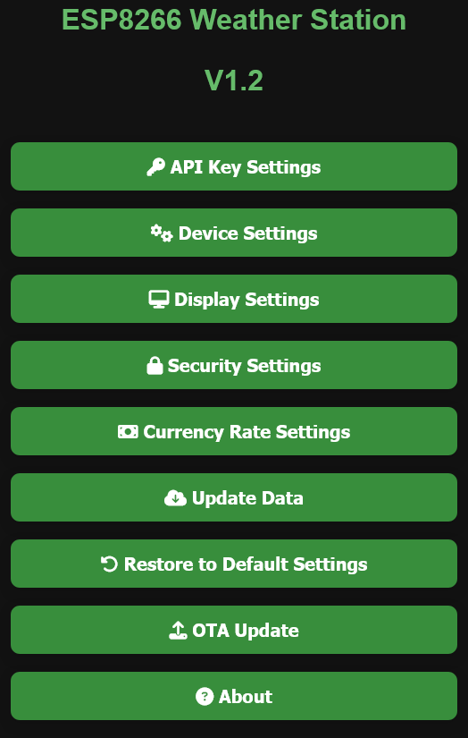
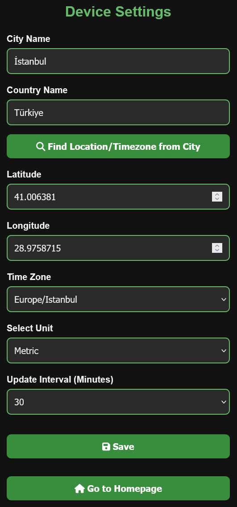
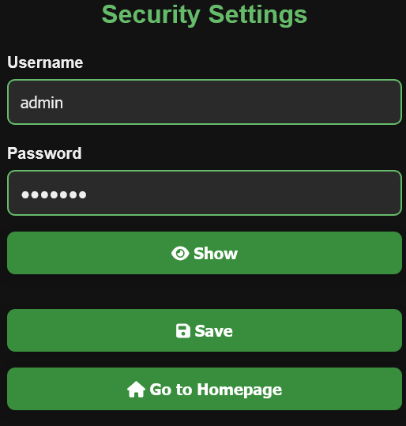
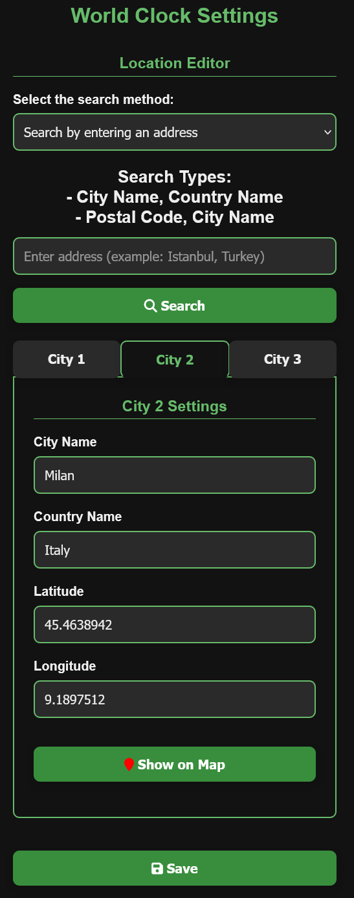
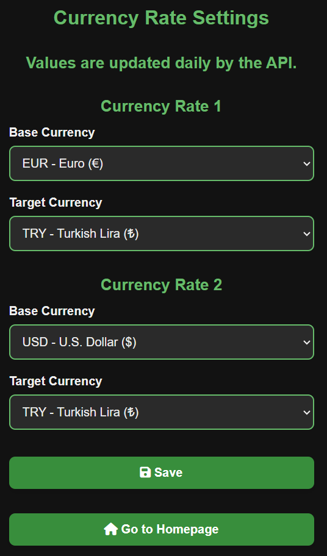

# ESP8266 Weather Station

[Türkçe Sürüm](README.md)

This project is based on the [ThingPulse - WeatherStationDemo](https://github.com/ThingPulse/esp8266-weather-station/tree/master/examples/WeatherStationDemo) example and has been significantly extended to include real-time data, a mobile-friendly interface, and many advanced features.

## Features

- Synchronous Web Server with a user-friendly web interface
- Settings Pages: Configure device, security, world clocks, currency and restore defaults
- OTA Updates: Remote firmware updates with ElegantOTA v3
- WiFiManager: No hardcoded Wi-Fi credentials required
- Live Weather & Air Quality (AQI): From OpenWeatherMap
- UV Index: Real-time UV data from Open-Meteo API
- Currency Rates: From Floatrates API
- Time & Date Display: Synced using NTP servers
- World Clock: View current time in multiple cities
- Night Mode (Hardware): OLED screen turns off/on automatically based on configured time
- Theme Support: Light and dark theme options in the web interface (The theme selection will automatically be the same as the theme used in the system.)
- Mobile-Friendly Interface: Fully responsive design
- Multi-language Support: Currently supports **Turkish** and **English**

## Web Interface Screenshots

Home Page

Device Settings

Security Settings

World Clock Settings

Currency Settings

## Setup Instructions

- Create a free account on [OpenWeatherMap](https://openweathermap.org) and [OpenCage](https://opencagedata.com) and obtain API keys.

- Open the project using Arduino IDE or PlatformIO.
- If you are opening the project using PlatformIO, first open `platformio.ini` and wait for the libraries to download in the terminal window. It will automatically download all the necessary libraries.
- If you are opening the project using Arduino IDE, first install the ESP8266 board. Then install the following libraries:
  - [ESP8266 and ESP32 OLED driver for SSD1306 displays](https://github.com/ThingPulse/esp8266-oled-ssd1306)
  - [ElegantOTA](https://github.com/ayushsharma82/ElegantOTA)
  - [WiFiManager](https://github.com/tzapu/WiFiManager)
  - [Json Streaming Parser](https://github.com/squix78/json-streaming-parser)
  - [ArduinoJson](https://github.com/bblanchon/ArduinoJson)

- Then open the `esp8266_WeatherStation.ino` file:
  - If you want to use Turkish, change `#include "lang_tr.h"`, if you want to use English, change `#include "lang_en.h"`. This selection specifies the language of the text on the OLED and web page.

- Upload the software to the NodeMCU (ESP8266) device.

- If your WiFi network is already configured, it will connect automatically. You do not need to configure the WiFiManager settings.

- When the device is turned on, if WiFiManager is active, connect to the WiFi network displayed on the OLED screen to open the settings portal.
  - Click the **Configure WiFi** button.
  - Select the WiFi network from the list above.
  - Enter your WiFi network password.
  - Click the **Save** button.
  - The system will then automatically connect to the WiFi network you selected.

- After connecting to the WiFi network, the device's IP address will be displayed on the OLED screen. Go to that IP address via your browser. If you can't see it, don't worry. The page displaying the IP address is among the pages that will appear during normal use. You can also find the IP address there.

- After going to the IP address, you will be greeted by the main page of the web interface.

- When you want to go to the settings pages, you will be asked for a username and password. The default username is `admin` and the default password is `esp8266`. You can change them from the **Security Settings** page if you wish.

- First, go to the **Device Settings** page via the web interface:
  - Enter the OpenWeatherMap and OpenCage API keys.
  - Enter the district, city names, and country code, then click the **Find Location/Time from City** button. It will automatically configure the other necessary settings for you.
  - Enter the update frequency in minutes.
  - Enter the start and end times for night mode scheduling.
  - Click the **Save** button. After clicking, you will be automatically redirected to the main page. At the same time, the data will be updated with new values on the OLED screen.

- Then, go to the **World Clock Settings** page via the web interface:
  - For 3 cities, you only need to enter the city name and country code. Then click the **Get Time Zones for All Cities** button. It will automatically make the necessary settings for you.
  - Click the **Save** button. After clicking, it will automatically redirect you to the main page.

- Then, go to the **Currency Rate Settings** page via the web interface:
  - Select the base currency and target currency for 2 currency exchange rates.
  - Click the **Save** button. After clicking, you will be automatically redirected to the main page. At the same time, the data will be updated with the new values on the OLED screen.

- After checking the values you have selected on the OLED screen, you can start using it with peace of mind.

- To change the settings you have selected at a later time, you can go to the relevant page on the web interface and make the necessary changes.

## Hardware Requirements

- ESP8266 (NodeMCU, Wemos D1 Mini or similar)  
- 0.96" I2C OLED Display (SSD1306)  
- Wi-Fi connectivity  
- 5V USB power supply

### OLED - NodeMCU (ESP8266) Wiring Table

| OLED Pin Name | NodeMCU (ESP8266) Pin |
|---------------|------------------------|
| GND           | GND                    |
| VCC           | 3V3                    |
| SCL           | D1 (GPIO5)             |
| SDA           | D2 (GPIO4)             |

Wiring Diagram Source: [Random Nerd Tutorials](https://randomnerdtutorials.com/esp8266-0-96-inch-oled-display-with-arduino-ide/)

## Credits

- Demo Base: [ThingPulse / WeatherStationDemo](https://github.com/ThingPulse/esp8266-weather-station/tree/master/examples/WeatherStationDemo)  
- OLED Display Library: [ESP8266 and ESP32 OLED driver for SSD1306 displays](https://github.com/ThingPulse/esp8266-oled-ssd1306)  
- OTA: [ElegantOTA](https://github.com/ayushsharma82/ElegantOTA)  
- Weather Data: [OpenWeatherMap](https://openweathermap.org)  
- UV Index: [Open-Meteo](https://open-meteo.com)  
- Time Sync: [NTP Servers](https://pool.ntp.org)  
- WiFi Config Portal: [WiFiManager](https://github.com/tzapu/WiFiManager)  
- Currency Data: [Floatrates](https://www.floatrates.com)  
- Night Mode Feature: [Qrome / PrinterMonitor](https://github.com/Qrome/printer-monitor)
- JSON: [Json Streaming Parser](https://github.com/squix78/json-streaming-parser) and [ArduinoJson](https://github.com/bblanchon/ArduinoJson)
